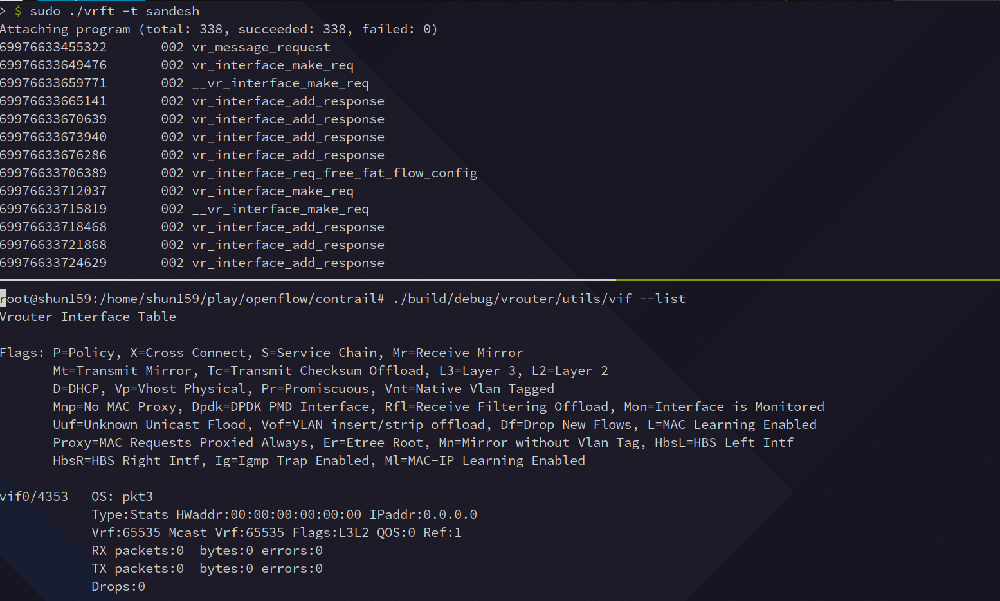

# vrftrace (Proto.)

__Heavily inspired by [YutaroHayakawa/ipftrace2/](https://github.com/YutaroHayakawa/ipftrace2/) implementation.__

Currently, support only trace the sandesh request message function calls.

## Requirements

- Architecture: x86_64

- Linux version: v4.17 or above(tested on v5.15)

- Kernel config

  - CONFIG_DEBUG_INFO_BTF=y
  - CONFIG_KPROBES=y
  - CONFIG_PERF_EVENTS=y
  - CONFIG_BPF=y
  - CONFIG_BPF_SYSCALL=y

  - CONFIG_DEBUG_INFO_BTF_MODULE=y (Optional)
